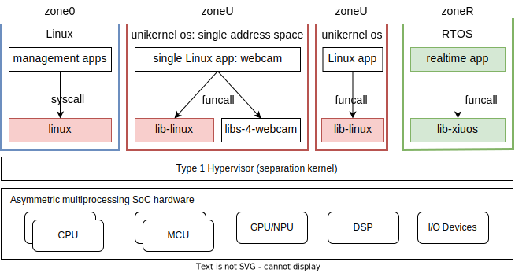
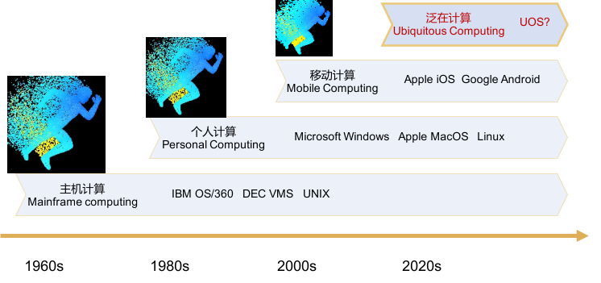
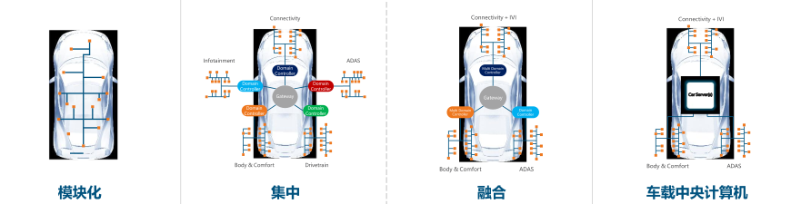

# 矽望：是什么，为什么

## 简介

**矽望Syswonder是什么？** 

矽望是一个开源社区，由一群系统软件爱好者自发形成，致力于探索和构建适合特定泛在应用场景的新形态操作系统。

在当前阶段，主要目标是针对实时非实时任务混合运行的边缘计算场景，如医疗设备、车辆控制、工业控制、无人系统等领域，面向非对称多处理器SoC（MCU， CPU， DSP等）新型硬件平台对现有操作系统管理机制带来的挑战，在操作系统架构和实现机制上尝试创新：

- 在架构方面，现有宏内核存在系统复杂性高的问题，微内核存在性能差的问题，我们将借鉴separation kernel、unikernel等设计思想，探索新形态的操作系统架构，尝试新的应用运行和资源管理方式。

- 在实现机制方面，现有操作系统主要采用C语言实现，C语言代码容易存在内存方面的缺陷。我们将用内存安全的Rust语言构建安全、高效、专用的新型态泛在操作系统。

为了实现上述目标，社区将主要聚焦下述项目：

- 一个轻量化的Type 1 hypervisor，主要遵循[separation kernel](https://en.wikipedia.org/wiki/Separation_kernel)思想，主要功能
  是通过严格分区（zone）保证各个分区在时间和空间上的严格隔离，从而
  可以同时支持各个分区独立互不干扰运行。分区常见的形式是轻量虚拟机。通过
  Type 1 hypervisor的分区隔离，实时RTOS和非实时的Linux或Android虚拟机可
  以正常运行，满足各自的应用需求。separation kernel常见于面向高可靠高安全(safety)应用的操作系统，如[PikeOS](https://www.sysgo.com/fileadmin/user_upload/data/professional_article_download/SYSGO_PA_2019-03_Separation_Kernel_as_a_basis_for_certifiable_applications_and_systems.pdf)。
  目前设计支持三种分区：承担系统管理任务的zone0，一般是简化版的Linux；承
  担高算力计算任务的zoneU，一般是unikernel OS；承担实时计算任务的zoneR，
  一般是面向MCU的RTOS。

- 一个兼容Linux应用的轻量化库操作系统，主要遵循[unikernel](https://en.wikipedia.org/wiki/Unikernel)设计思想，考虑到边缘泛在计算场景下，应用通常数目有限且相对固定，因此将操作系统简化设计为只支持单应用，将内核功能封装为库，以系统调用的形式提供给应用，应用直接运行在内核态。这种库形态的操作系统应用性能会有极大提升，安全问题(security)主要交给底层的Type 1 hypervisor解决。库形态的操作系统需要良好的工具支持，以方便用户根据单一应用生成构造可运行的二进制镜像，如[unikraft](https://unikraft.org)。

- 一组用Rust语言实现的操作系统基础构件（component），如文件系统、网络协议栈、内存管理器、消息通信机制等。基于这些构件可实现特定的库操作系统。

- 对Hypervisor等关键系统进行形式化验证。

底层硬件方面，将面向非对称多处理器SoC（MCU， CPU， DSP等）新型硬件平台。前期将基于QEMU，之后将基于物理开发板进行。

## 动因

为什么我们要开展上述研究工作？原因是我们认为目前的应用需求和运行平台及环
境正在急剧变化，进入一个人机物融合泛在计算的新时代。而当前主流的通用操作
系统如Linux、Android等在结构和特性等方面已经难以适应这种变化，亟需新形态
的操作系统支撑，这种新形态的操作系统被北京大学教授、中科院院士梅宏称为[“
泛在操作系统”](http://www.bulletin.cas.cn/publish_article/2022/1/20220105.htm)。

梅宏院士认为，由于泛在计算场景的领域行业特定性、泛在计算资源的广谱多样性
和极端特异性，泛在操作系统的领域性和专用性将会比较突出，有必要面向不同的
应用模式和场景构建不同的泛在操作系统。因此，不会有“大一统”的通用、普适的
泛在操作系统，而是会存在领域或应用场景定制的多样性的泛在操作系统。梅宏院
士同时提出了操作系统发展的“**20年周期律**”，认为操作系统已经进入新的20年
发展周期，蕴含广阔的发展创新空间。

在这样的背景下，我们建立矽望开源社区，面向实时任务与非实时任务混合运行的
边缘计算场景，开展新形态操作系统的探索研究与实验验证，希望能吸引汇聚国内
外对此感兴趣的开发者，共同打造有影响力的成果产出。

### 操作系统的20年周期律

操作系统是计算系统的核心，也是信息产业生态的核心，更是信息时代安全的基石。
操作系统向下管理各种硬件资源，向上为用户和应用程序提供服务支持。正是操作
系统的出现，才使得计算机从早期的专用专属走向如今的通用大众，并带来计算机
应用的繁荣。

考察操作系统几十年来的发展，其主要驱动力是面向计算机硬件的迅速发展，以更
好、更高效地管理硬件资源并充分发挥硬件资源所提供的计算能力；同时，面向新
的应用需求和用户需求，沉淀应用领域共性，提供更便利、易用的人机交互和应用
支撑。因此，随着新型硬件资源的发展和新型应用模式的出现，操作系统不断演化
和变迁。

梳理操作系统发展的重要事件及其时间节点，其重大变迁存在“**20 年周期律**”，即
每 20 年出现一次跨越式发展机遇，诞生新一代操作系统。主机计算时代（20 世
纪 60—80 年代）的 IBM OS/360、DEC VMS 和 UNIX，个人计算时代（ 20 世纪 80
 年代—2000年）的微软 Windows 和开源 Linux，以及移动计算时代（2000—2020 
年）的谷歌 Android 和苹果 iOS 是各自时代的代表性操作系统，并引领了各自领
域的操作系统生态。当然，“20 年周期律”并不是说操作系统的新生态取代了旧生
态，而是新、旧生态并存，但新生态相比旧生态在装机数量和用户规模上却是 1—2
 个数量级的扩张。

在这个变迁过程中存在几个现象：每代操作系统形成规模、占领市场、形成垄
断后，鲜有在原赛道上后发赶超的例子；原赛道的领先者均未在新型操作系统的新
蓝海延续其成功，如 IBM 之于个人电脑（PC）操作系统市场、微软之于智能终端
操作系统市场等；新生态的引领者均试图采用“农村包围城市”的策略进军原有生态，
如微软进军服务器操作系统市场、谷歌进军桌面操作系统市场等。

“20 年周期律”是源于计算机产业发展的“贝尔定律”，即计算设备约每 10 年完成 
1 次升级换代，设备数和用户数均增加至少 1 个数量级。客观而言，新型计算模
式及激增的新型计算设备共同催生了新型应用，带来新的蓝海和巨大创新空间，间
次推动操作系统的升级换代和新型操作系统的诞生，进而形成新的操作系统生态。
在每次升级换代的阶段，原赛道的领先者可能因为“思维定式”和“路径依赖”，往往
对新蓝海的机遇反应缓慢，因而痛失良机。而新形态的引领者往往都先占据了新蓝
海的用户入口掌控权，如微软之于个人计算、谷歌之于万维网和移动计算。对于通
用计算领域，领先者一旦建立并完善新的产业生态，就占有了生态主导权，后发者
就很难有机会实现赶超。历史经验表明，如果希望在操作系统领域有所作为，就必
须把握住新蓝海出现带来的宝贵机遇。

### 泛在操作系统

当前，随着互联网向人类社会和物理世界的全方位延伸，一个万物互联的人类社会、
信息系统、物理空间（人机物）融合泛在计算（ubiquitous computing）的时代正
在开启。据全球综合数据资料库Statista发布的数据，2019 年全球联网的物联网
终端数量已达百亿，超过了非物联终端的数量，2025 年预计将突破 300 亿，未来
千亿规模已然可期。

面向未来人机物融合泛在计算的新模式和新场景，软件定义一切、万物均需互联、
一切皆可编程、人机物自然交互将是其基本特征。除传统计算设备（“机”）和新兴
物联设备（“物”）外，“人”作为一种新的重要元素的参与，构成了极其复杂且动态
多变的计算环境。

所谓泛在计算，是指计算无缝融入物理环境，无处不在、无迹可寻。泛在计算的环
境多变、需求多样、场景复杂，要求硬件资源、数据资源、软件平台、应用软件具
有柔性灵活的软件定义能力、动态适配能力、泛在互联能力和自然交互能力：

- 面向“物”，海量的、更为轻量级的各类计算、传感设备带来系列管理调度新挑战；

- 面向“人”，“人在回路”导致不确定的复杂交互和动态按需定制；

- 面向“网”，物联场景带来低延迟更可靠的刚需；

- 面向“应用”，动态多样性带来新的共性凝练需求……；

这些均是现有操作系统尚不具备的能力。从“20 年周期律”的视角，千亿规模的各类泛
在物联终端和新型的泛在计算模式的出现，意味着操作系统进入新的 20 年发展周
期的条件已然具备，新的蓝海已然出现。

人机物融合泛在计算模式的新特征对新型操作系统带来的挑战是全方位的：既需要
面临“云-管-边-端-物”乃至“人”的海量异构资源尤其是各种泛在化的“端”资源的有
效管理，也需要进行各种多样化的新型应用的共性凝练，还需要支持和适应场景动
态多变的复杂泛在计算环境，应对开放环境带来的安全可信挑战。

国内外学术界和产业界已有不少面向特定计算场景和新型业务需求的新型操作系统
实践。例如，美国西北大学提出面向信物融合的先进制造操作系统计划；谷歌公司
提出 Fuchsia OS 计划，用于支持桌面设备、移动终端、物联网设备及其互联；大
众汽车公司启动 vw.os 汽车操作系统计划，尝试转型“软件公司”，将可能对上下
游产业链产生变革性影响；阿里巴巴公司推出以驱动万物智能为目标的移动操作系
统 AliOS；华为公司发布了面向全场景、全连接的智能终端操作系统鸿蒙 OS 和 
Open Harmony 等。此外，还出现了众多的物联网节点操作系统，如 FreeRTOS、
RIOT、Zephyr、TinyOS、Contiki、Android Things 等，而这些均可归为针对泛在
计算场景的操作系统。

上述新型操作系统实践大多是从传统的嵌入式操作系统技术途径针对特定泛在计算
场景进行切入和扩展，在资源管理、网络协同、人机交互、应用模式等方面分别进
行了新的技术探索。嵌入式系统主要面向微控制器等资源受限环境，并且与物理世
界直接交互，因此需要非常轻量化，并要保证实时性（时间确定性），嵌入式系统
及其操作系统可被视为原始的“泛在计算”尝试。近年流行的物联网操作系统则在嵌
入式操作系统的技术基础上，强调对“连接”及建立在连接基础上的分布计算甚至
“云-边-端”融合计算的支持，从而支撑“万物互联”的目标。嵌入式操作系统和物联
网操作系统技术体系过于碎片化，存在所谓的“昆虫纲问题”，在计算模型、共性凝
练、人机交互、安全保障等方面均难以满足人机物融合泛在计算的需求。

基于对各类新型操作系统研发实践的梳理和对泛在计算场景的理解，梅宏院士提出，
面向人机物融合泛在计算场景，需要“沉淀”一类新型操作系统——沿袭过去以计算模
式分类操作系统的惯例，可称为“泛在操作系统”（Ubiquitous Operating System，
UOS）。

### 边缘泛在计算场景

医疗设备、车辆控制、工业控制、无人系统等领域是典型的边缘泛在计算场景，这
些边缘场景的典型特点是高实时高可靠任务与高算力任务混合运行，硬件资源多样
复杂，对操作系统提出了新的挑战。

以车用操作系统为例。车用操作系统分为车控操作系统和车载操作系统。其中，车
控操作系统分为安全车控操作系统和智能驾驶操作系统，安全车控操作系统面向车
辆控制领域，比如动力系统、底盘系统、车身系统等，对实时性和安全性要求极高，
相对成熟；智能驾驶操作系统面向智能驾驶领域，应用于智能驾驶域控制器等，除
了实时性和安全性要求外，还需要高算力支持，智能驾驶操作系统是目前汽车操作
系统领域的竞争焦点。车载操作系统面向信息娱乐和智能座舱，主要应用于车机中
的控制系统，主要竞争者为QNX、Linux和Android，格局相对稳定。

随着汽车功能逐步向网联化、智能化发展，汽车的电子电气架构由传统分布式向集
中式和融合式发展，未来的趋势是通过一台车载中央计算机提供所有的驾驶控制以
及座舱娱乐功能，这对车载中央计算机上的车用操作系统提出了严重挑战，要求其
要同时满足高实时、高安全、高算力、易定制的要求，还要有强大的生态，支持实
现软件定义汽车的愿景。

现有的操作系统都难以满足上述需求，无论是Linux或者QNX都存在某些方面的短板，
需要在新形态内核架构、采用新型安全编程语言实现、软硬协同机制、形式化验证
等方面进行新的探索。

